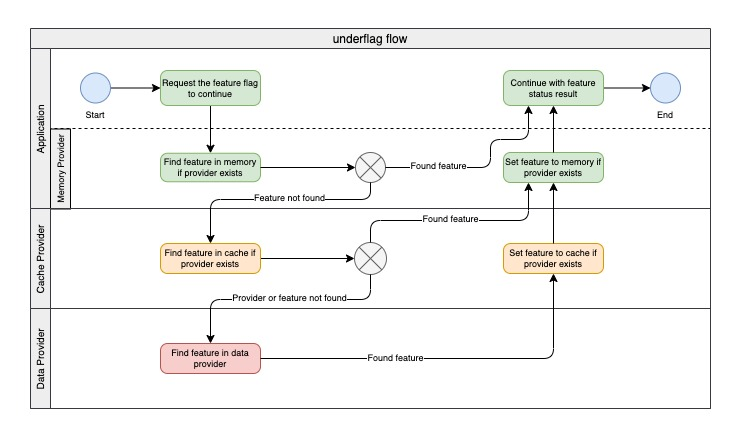

# underflag

This is a node **Feature Flag (Feature Toggle)** module with common data/cache providers like json, mongodb, mysql, redis and others.

If you need more flexibility in your apps, like enable/disable features in production without change environments to deploy manualy or rerun the pipeline, this module is pretty good for you and your team.

It's not only used to turn on or turn off features or test A/B, you can use it to config your app in realtime, getting values from anywere (file, memory, databases, cache, api, realy anywere) to inject in your business logic to change it when you want.

## Why should I use this one instead of create my own or use another?

- Because it's easy to use, small size and you don't need to spend more time to code again.

- Moreover, you can implement your own provider, just extending or implementing some provider or interface.

- With this module, you can using your own infrastructure, like local or cloud databases, very important when your product or company is not so flexibility to explore other services.

## Install

Using npm:

```bash
npm install underflag
```

Using yarn:

```bash
yarn add underflag
```

## How to use

Import the underflag and prepare to load data from some provider

_Using implicit json data provider_
```js
import { Underflag } from "underflag";

const data = { test_a: true, test_b: false };
const underflag = new Underflag({ dataProvider: data });

if (await underflag.isOn("test_a")) {
    // ...
}
```

_Using explicit json data provider_

```js
import { Underflag, JsonDataProvider } from "underflag";

const dataProvider = new JsonDataProvider({ "test_a": true });
const underflag = new Underflag({ dataProvider });
````

## Others providers

Provider | Package | Use
--- | --- | ---
HTTP | https://www.npmjs.com/package/underflag-http | Server or Client
MongoDB | https://www.npmjs.com/package/underflag-mongodb | Server
Mongoose | https://www.npmjs.com/package/underflag-mongoose | Server
Redis | https://www.npmjs.com/package/underflag-redis | Server
Memcached | https://www.npmjs.com/package/underflag-memcached | Server
MySQL | https://www.npmjs.com/package/underflag-mysql | Server
PostgreSQL | https://www.npmjs.com/package/underflag-postgresql | Server
DynamoDB | https://www.npmjs.com/package/underflag-dynamodb | Server
Firebase Remote Config - Admin | https://www.npmjs.com/package/underflag-firebase-admin | Server

## The possible flow using memory + cache + data providers

<p align="center" width="100%">
    
</p>

## Examples

### Using data provider with **Memory** provider

```js
import { Underflag, MemoryProvider } from "underflag"; 

(async() => {
    // memory provider
    const memoryProvider = new MemoryProvider({ lifetime: 5 });

    const underflag = new Underflag({ dataProvider: data, memoryProvider });
    
    await underflag.isOn('test_a'); // get from data provider and load memory
    await underflag.isOn('test_a'); // get from memory provider
    // after 5seg
    await underflag.isOn('test_a'); // get from data provider and load memory again
})();
```

If you prefer, you can load all features from data provider to memory.

```js
await underflag.loadMemory();
await underflag.isOn("test_a"); // from memory
await underflag.flushMemory(); // reset memory
```

Check the feature status:

```js
const isOn = await underflag.isOn("test_a"); // return true or false
const isOff = await underflag.isOff("test_a"); // return true or false
```

Get a complete feature data:

```js
const data = await underflag.get("test_a");
console.log(data); // return undefined or feature object
```

Get many complete features data:

```js
const [test_a, test_b] = await underflag.getMany(["test_a", "test_b"]);
console.log("test_a", test_a);
console.log("test_b", test_b);
```

Get the feature value:

```js
const value = await underflag.getValue("test_a");
console.log(data); // return null or feature value
```

Get the features values:

```js
const [value_a, value_b] = await underflag.getValues(["test_a", "test_b"]);
console.log(value_a);
console.log(value_b);
```

## Using your own data, cache or memory provider implementation

Just create your own class than implements IDataProvider, ICacheProvider or IMemoryProvider and pass to Underflag. 

### Feel free to contribute

- If you find a bug or have a good idea, share with us.

- And if you create a new module to data or cache provider, let us know to add here to help community.

### License

[MIT](LICENSE)